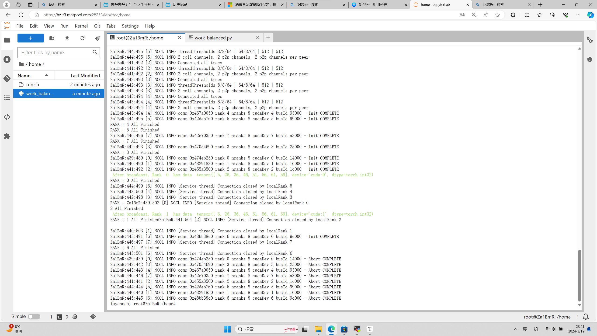

### 构件：数据并行自动负载均衡的策略验证测试

#### 一、实验目的

我们再获得最大的训练batchsize数组之后和最优batchsize后我们需要进行负载均衡，保证所有的batchsize都能正常训练。

#### 二、实验环境

```
Ubuntu20.04
Python 3.10
Pytorch 2.0.1
CUDA 11.8
cuDNN 8
NVCC
VNC
```

主要是在锯齿云上组建了分布式集群进行了测试。

使用以下的命令进行运行（但是要注意配置网络，设置一些环境参数，这个在pytorch官网的DDP讲解中说过）

```
bash run.sh
```

#### 三、实验结果



