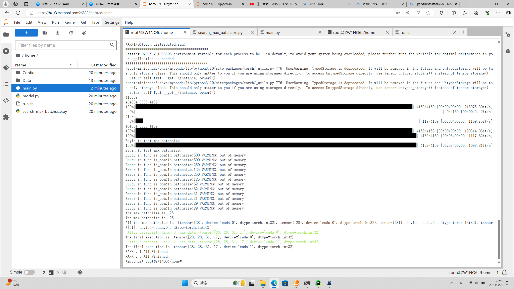

### 组合测试：最大batchsize检测和数据负载均衡组合测试

#### 一、实验目的

前面书写了最大batchsize检测模块和数据负载均衡模块，现在将这两个模块组合在一起，实现组合测试。

#### 二、实验环境以及如何运行。

```
Ubuntu20.04
Python 3.10
Pytorch 2.0.1
transformers 4.39.0
CUDA 11.8
cuDNN 8
NVCC
```

使用下面的命令进行运行在锯齿云的平台上进行了运行：

```
bash run.sh
```

注意要保证下面的文件结构：

```
---
	|--Data
		--data.jsonl
		--load_data.py
	|--Config
		--config.json
		--pytorch_model.bin
		--tokenizer.json
		--tokenizer_config.json
		--vocab.txt
	main.py
	model.py
	search_max_batchsize.py
```

Data和Config文件夹下面的东西太大无法上传到github，所以得去huggingface的bert_base_uncased和dair-ai/emotion下面去下载。

#### 三、实验结果

我们使用了两台机器，其中一台是两张A16GPU，剩下一台是两张P100GPU。

无法满足的情况：


调度成功的情况：

