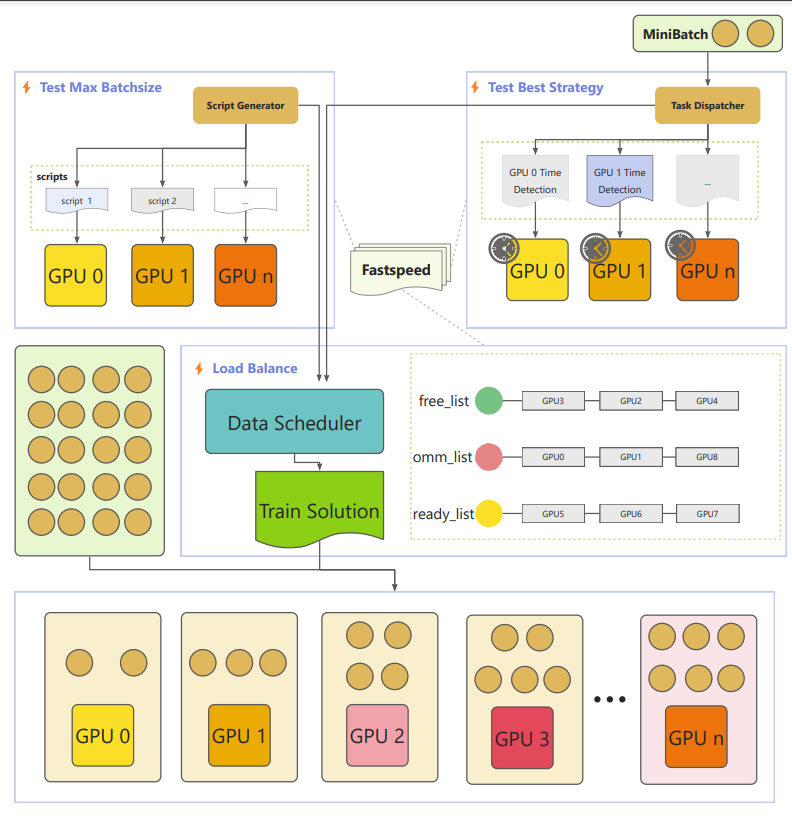

------
<div>
    <h3 align="center">FastSpeed : A fast way to run for DNN on Heterogeneous GPU clusters</h3> 
</div>


# 1. Introduction

------

Based on DDP, FastSpeed is a platform based on Pytorch that accelerates model training on heterogeneous GPU clusters. The platform automatically assigns varying amounts of training data to different types of GPUs. This load balancing strategy allows more powerful GPUs to process more data examples, reducing communication overhead and ultimately improving training speed.


# 2. Main structure



The main process can be divided into three steps:

1.  Test each GPU max data load they can afford.
2. Based on execution time, calculate the best strategy to distribute data.
3. Adjust the final train solution because the bast distribution strategy doesn't mean that it can work on the real hardware. So the platform should sacrifice some performance to guarantee it can really run the GPU clusters.


# 3. File Layout

------

```
│ 
├─Alexnet    # train on Alexnet model
├─Bert_base_uncasted  # train on Bert_base_uncasted model
├─Fastspeed  
│  ├─help 
│  ├─Temp #
│  ├─Test  # test each module part whether it is correct 
│  │  ├─Batchsize_Balance 
│  │  │  └─.idea
│  │  │      └─inspectionProfiles
│  │  ├─Is_OOM_Newshell
│  │  │  ├─Config
│  │  │  └─Data
│  │  │      └─__pycache__
│  │  ├─MaxBatchsize_AutoBalance
│  │  │  ├─Config
│  │  │  └─Data
│  │  │      └─__pycache__
│  │  ├─MaxBatchsize_Search
│  │  │  ├─.idea
│  │  │  │  └─inspectionProfiles
│  │  │  ├─Config
│  │  │  └─Data
│  │  │      └─__pycache__
│  │  ├─MaxBatchsize_Search_Newshell
│  │  │  ├─.idea
│  │  │  │  └─inspectionProfiles
│  │  │  ├─cifar-10-batches-py
│  │  │  ├─Config
│  │  │  └─Data
│  │  ├─UnbalanceSplit_Test
│  │  │  └─.idea
│  │  │      └─inspectionProfiles
│  │  └─Unit_Test
│  └─utils
|    |__ calculation.py # calculate time cost
|	 |__ fastspeed.py # main part of the paragram
|	 |__ resource_detection.py # test the max resource one GPU can load 
|	 |__ sampler.py # split the data 
|    |__ scheduling.py # schedule the data
|    |__ utilstool.py # some auxiliary functions
|  
├─T5  # train on T5 model
└─vgg19  # train on vgg19 model
```


# 4. How to use

------


### 4.1 requirements

```
python=3.10
pytorch=2.0.1
transformers=4.39.3。
```

------

### 4.2 the main process of the usage:

1. Copy the  Fastspeed dir to your local path.

2. For example, using the T5 model (The core part) :

```python
from transformers import T5Tokenizer
from Fastspeed.utils.utilstool import Params
from Fastspeed.utils.fastspeed import FastSpeed


# The relevant model parameters for T5base.
parser.add_argument('--configPath', type=str, default="./T5base_config/", help="the path of model config")

# Define the tokenizer
tokenizer = T5Tokenizer.from_pretrained(args.configPath, legacy=False)

# Define model 
task_model = T5(args.configPath)

# Define a heterogeneous training platform.
train_platform = FastSpeed(param, args, input, label,True)

# Heterogeneous data partitioning on the platform.
train_loader = train_platform.unbalanced_datasplit(dataset=train_dataset, model=task_model)

# transfer the normal model into wrapped_model (ddp distributed)
wrapped_model = train_platform.model_wrap(task_model)

# train the model   
trained_model, epoch_loss_list, timeCost, throughput, totalThroughput = train_platform.train(train_loader=train_loader, wrapped_model=wrapped_model)
```

 For more details,  please refer to :

```python
./T5/main.py
```


3. On each machine, you should use following command to start the distributed program(pay attention to the main cluster id) 

   You should first start the main cluster and then the slave cluster.

   ```
   torchrun --nnodes=1 --nproc_per_node=4 --node_rank=0 --master_addr=127.0.0.1 --master_port=29502 main.py --json_path='/home/args.json' > Virtual_Bert_4GPU_2A162[A16]_ManualB30Log.txt 2>&1
   ```

   attention:

   ```
   nnodes:The number of your machines
   nproc_per_node:The GPU number on this machine
   node_rank:if this machine is the master node of the cluster, you should set node_rank equal 0 otherwise it is specifized as 1
   master_addr: master node's IP
   master_port: master node's port
   main.py: your train or finetune file 
   json_path: your config about the program
   ```

   ### 4.3 The explanation of each parameter in config.json

   In config.json, you can see:

   ```
   {
     "data": {
       "total_datasize": 50000,
       "train_loader_pin_memory": 0,
       "train_loader_num_workers": 2
     },
     "train":{
         "epochs":2,
         "batch_size": 1000,
         "iter_log_interval": 50,
         "epoch_log_interval": 1,
         "gradient_accumulate_step":1,
         "criterion": "CrossEntropy",
         "optimizer":"Adam",
         "learning_rate": 0.001,
   
         "isLoadModel": 0,
         "loadModelPath":"./checkpoint/Alexnet_10.pth",
         "saveModel": 1,
         "checkpoint_interval": 5,
         "checkpoint_folder": "./checkpoint"
     },
     "strategy": {
         "model_type": "ddp",
         "partition_type":  "autobalanced",
         "manual_partition_list": [12500,12500,12500,12500],
         "manual_batchsize_list": [250,250,250,250],
   
         "unbalanced_strategy": "time",
         "test_batchsize_bytime":500,
         "model_name": "AlexNet",
         "model_args": [10],
         "runing_dependency":["from model import * "]
     }
   }
   ```

| Interface Name           | Description                                                  | Notes                                                        |
| ------------------------ | ------------------------------------------------------------ | ------------------------------------------------------------ |
| total_datasize           | The size of the training dataset                             |                                                              |
| train_loader_pin_memory  | An option in PyTorch's Dataloader to lock the data in memory to avoid unnecessary CPU memory transfers |                                                              |
| train_loader_num_workers | Number of threads for data loading to speed up the process   | More threads do not always mean better performance           |
| epochs                   | Number of training epochs                                    |                                                              |
| batch_size               | Overall batch size used in model training                    |                                                              |
| iter_log_interval        | Number of iterations between logging the loss                | For 50,000 training samples with a batch size of 50, there are 1,000 iterations in one epoch. If `iter_log_interval = 10`, loss will be logged 100 times in one epoch |
| epoch_log_interval       | Number of epochs between logging the loss                    |                                                              |
| gradient_accumulate_step | Number of steps for gradient accumulation. A value of 1 means gradient accumulation is disabled |                                                              |
| criterion                | Loss function                                                |                                                              |
| optimizer                | Optimizer used for model training                            |                                                              |
| learning_rate            | Learning rate                                                |                                                              |
| isLoadModel              | Whether to load an existing model's parameters               |                                                              |
| loadModelPath            | Path to the stored model parameters                          |                                                              |
| saveModel                | Whether to save the model's parameters                       |                                                              |
| checkpoint_interval      | Number of epochs between saving model checkpoints            |                                                              |
| checkpoint_folder        | Folder where model checkpoints are saved                     |                                                              |
| model_type               | Strategy used for distributed acceleration. For example      | `ddp` stands for data parallelism                            |
| partition_type           | Strategy for data partitioning.                              | For example, `manual` represents manual partitioning, `autobalanced` represents system-based automatic partitioning |
| manual_partition_list    | List of data partitions.                                     | Valid when `partition_type = manual`                         |
| manual_batchsize_list    | List of batch size partitions.                               | Valid when `partition_type = manual`                         |
| unbalanced_strategy      | Metric used to evaluate GPU computation capability.          | Valid when `partition_type = autobalanced`                   |
| test_batchsize_bytime    | small batch size used for testing when based on runtime.     | Valid when `partition_type = autobalanced`                   |
| model_name               | Name of the model being trained, used to generate training code. | Valid when `partition_type = autobalanced`                   |
| model_args               | Defines the model's input parameters, used to generate training code. | Valid when `partition_type = autobalanced`, 10 means 10 categories |
| runing_dependency        | Defines all dependencies required for model training, used to generate training code. | Valid when `partition_type = autobalanced`                   |


# 5. Limitation and Future Work

------


- Integrate Pipeline parallelism , Tensor parallelism and other mixture parallelism with this work on Heterogeneous GPUs
- Initiating multiple processes to test data load is highly resource-intensive. I may think a better way.
- The way the data is divided does not have a strict mathematical proof.
- This is just a small demo, and it has not been tested on a large model yet, so it is currently unclear whether it can achieve acceleration.


