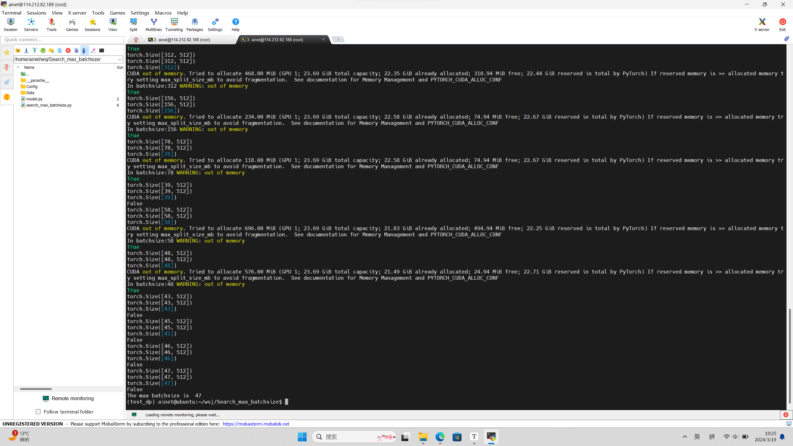
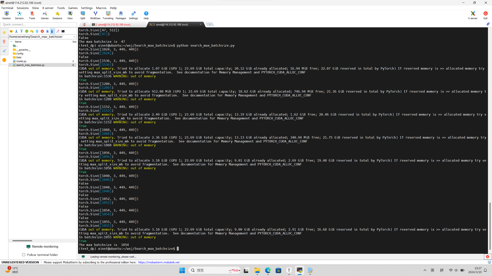
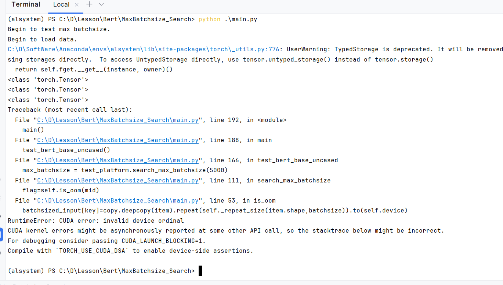
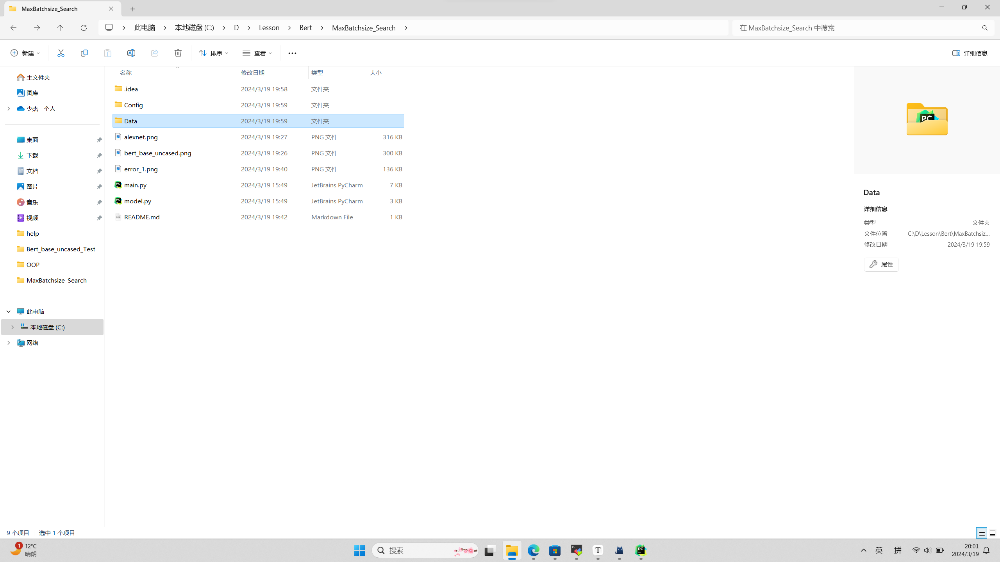
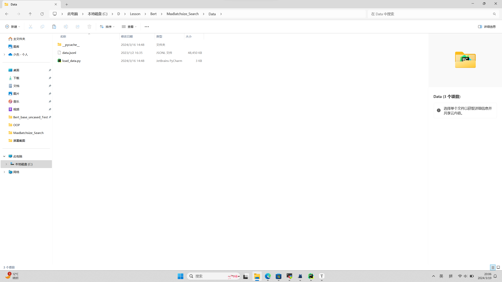
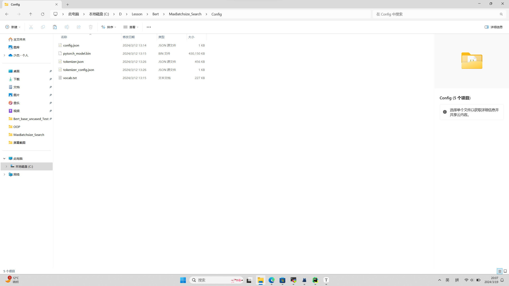

## 构件：搜寻模型在GPU上所能承受的最大Batchsize

#### 一、实验目的

加载一个模型到GPU上面，测试训练这个模型能承受的最大Batchsize，这将为后面的自动调度提供重要的参考。

#### 二、实验环境

```
torch==1.12.1
pandas==2.2.1
transformers==4.38.2
python==3.9.18
```

使用Anaconda虚拟环境将上述的依赖包粘贴到requirements.txt中并使用以下命令进行安装：

```
pip install -r requirements.txt
```

#### 三、实验结果

##### bert_base_uncasted:



##### Alexnet:



#### 三、实验收获以及遇到的问题

##### 1、在window平台跑了一直报错，换到linux平台就好了。



##### 2、文件结构。

整体结构：



Data文件结构：



Config文件结构:



相应的模型权重和数据集下载地址：

模型权重：[google-bert/bert-base-uncased at main (huggingface.co)](https://huggingface.co/google-bert/bert-base-uncased/tree/main)

数据集：[dair-ai/emotion · Datasets at Hugging Face](https://huggingface.co/datasets/dair-ai/emotion)
